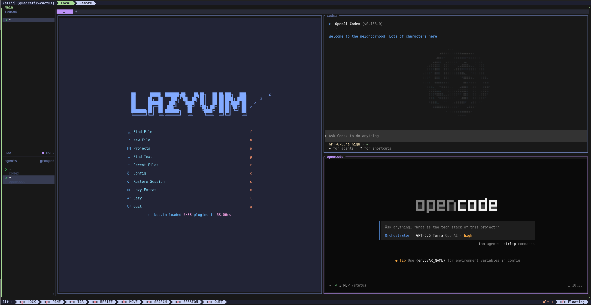
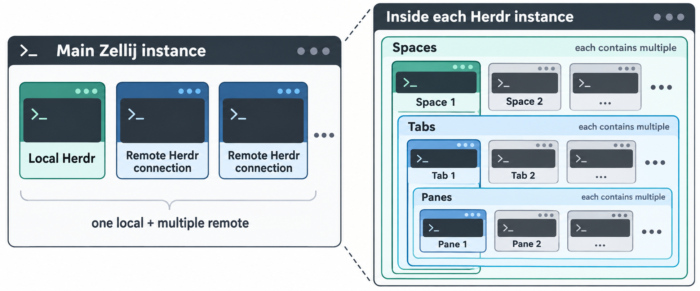

# Dotfiles

Personal configuration for Neovim/LazyVim, Zellij, Herdr, Codex, and OpenCode.



## Intended terminal workflow

The main Zellij instance holds multiple Herdr instances, usually one local
instance and multiple remote connections. Each Herdr instance contains spaces;
each space contains tabs; each tab contains panes.



## Install

Clone this repository, preview the changes, then run the installer:

```sh
./install.sh --dry-run
./install.sh
```

The installer asks which applications to configure and links their files into
the locations below. It does not install the applications or external command
line tools, or sign in to accounts. Neovim bootstraps LazyVim and its plugins
on first launch.

If a destination already exists, the installer asks before replacing it. A
replaced path is moved to `~/.dotfiles-backup/<timestamp>/`, preserving its
original path beneath that directory. Neovim is merged file-by-file when its
configuration directory already exists, so unrelated files remain in place.

Useful options:

```sh
./install.sh --help
./install.sh --dry-run --yes  # preview every application and replacement
./install.sh --yes            # configure every application and approve replacements
```

`--yes` still creates backups. `--dry-run` makes no changes.

## What gets configured

The default configuration root is `~/.config`; `XDG_CONFIG_HOME` is used when
set. Codex files are installed under `~/.codex`.

- **Neovim/LazyVim** — `nvim/` is merged into `~/.config/nvim/`. It contains
  the LazyVim bootstrap, editor options (including autoread, column guides, and
  diagnostic filtering), plugin specifications, and plugin lockfile.
- **Zellij** — `zellij/config.kdl` becomes
  `~/.config/zellij/config.kdl`. It configures modal keybindings for pane,
  tab, resize, move, scroll, search, and session actions.
- **Herdr** — `herdr/config.toml` becomes
  `~/.config/herdr/config.toml`. It sets a `Ctrl+B` prefix, pane and tab
  shortcuts, shell working-directory behavior, scrollback, and interface
  preferences.
- **Herdr Neovim plugin** — `herdr-nvim/config.toml` becomes
  `~/.config/herdr-nvim/config.toml` and sets the plugin sidebar position.
- **Codex** — installs `codex/config.toml`, hooks, agents, rules, and the
  repository's personal skills under `~/.codex/`. The config file is set to
  mode `0600`. It sets the model and approval behavior, the built-in workspace
  permission profile, and custom agent and hook behavior.
- **OpenCode** — installs `opencode.jsonc`, `oh-my-opencode-slim.json`,
  `tui.json`, `tui.jsonc`, `herdr-tui-session.js`, and `package.json`, plus the
   `agents`, `commands`, `hooks`, `plugins`, and `skills` directories under
   `~/.config/opencode/`. These set plugin configuration, terminal preferences,
   custom workflows, and hooks. `package.json` declares the plugin dependency.

## Credentials and local state

Authentication files and application state are not part of the configuration
set. The installer leaves Codex authentication, history, and databases alone.
For OpenCode, it leaves credentials, installed dependencies, and the package
lockfile alone. The repository also excludes caches, logs, generated install
metadata, and bundled Codex system skills.

The OpenCode plugin dependency is not installed automatically. If it is
missing, the installer prints the `npm install` command to run after reviewing
the manifest.

## Zellij and Herdr hotkeys

### Zellij

The config starts in normal mode. These shortcuts switch modes:

| Shortcut | Mode |
| --- | --- |
| `Alt+p` | Pane |
| `Alt+t` | Tab |
| `Alt+n` | Resize |
| `Alt+h` | Move pane |
| `Alt+o` | Session |
| `Alt+s` | Scroll |
| `Alt+g` | Locked; press `Alt+g` again to return to normal |

In the mode-based shortcuts below, press the mode key after entering that mode.
`Enter` or `Esc` returns to normal mode in most modes.

| Mode | Shortcuts | Action |
| --- | --- | --- |
| Pane | `h/j/k/l` or arrows | Focus left/down/up/right |
| Pane | `n`, `d`, `r`, `s` | New pane, new pane below, new pane right, stacked pane |
| Pane | `w`, `f`, `i`, `e` | Toggle floating panes, fullscreen, pin, embed/floating |
| Pane | `x`, `c` | Close focused pane, rename pane |
| Tab | `n`, `x`, `r` | New tab, close tab, rename tab |
| Tab | `h/k`, `j/l`, `1`–`9` | Previous tab, next tab, select tab by number |
| Resize | `h/j/k/l` | Increase size left/down/up/right |
| Resize | `H/J/K/L`, `+`/`=`/`-` | Decrease size by direction, increase, or decrease |
| Move pane | `h/j/k/l`, `n`, `p` | Move pane left/down/up/right, next position, previous position |
| Scroll | `j/k`, `d/u`, `Ctrl+f` | Scroll line, half page, or full page |
| Scroll | `s`, `Enter`, `Ctrl+c` | Start search, enter search results, return to bottom and normal mode |
| Session | `w`, `d` | Open session manager, detach |

Useful mode-independent shortcuts include `Alt+arrows` to move focus between
panes or tabs, `Ctrl+PageUp/PageDown` to change tabs, `Ctrl+Shift+t` to create
and name a tab, `Ctrl+Shift+q` to close a tab, `Alt+f` to toggle floating
panes, and `Alt+q` to quit.

### Herdr

Herdr uses `Ctrl+B` as its prefix. Press the prefix, then the following key
unless a full chord is shown.

| Shortcut | Action |
| --- | --- |
| `Ctrl+B`, `g` | Go to workspace |
| `Ctrl+B`, `w` | Open workspace picker |
| `Alt+Up` / `Ctrl+Up` | Previous workspace |
| `Alt+Down` / `Ctrl+Down` | Next workspace |
| `Ctrl+B`, `q` | Detach |
| `Ctrl+B`, `b` | Toggle sidebar |
| `Ctrl+B`, `c` or `Ctrl+Shift+t` | New tab |
| `Ctrl+B`, `n` or `Alt+Right` / `Ctrl+Right` | Next tab |
| `Ctrl+B`, `p` or `Alt+Left` / `Ctrl+Left` | Previous tab |
| `Ctrl+B`, `1`–`9` | Select tab by number |
| `Ctrl+B`, `Shift+t` or `Ctrl+Shift+r` | Rename tab |
| `Ctrl+B`, `Shift+x` or `Ctrl+Shift+q` | Close tab |
| `Ctrl+B`, `h/j/k/l` | Focus pane left/down/up/right (`Alt+h` also focuses left) |
| `Ctrl+B`, `Tab` / `Shift+Tab` | Cycle panes forward / backward |
| `Ctrl+B`, `Shift+h/j/l` | Swap pane left/down/right; `Alt+Shift+k` swaps up |
| `Ctrl+B`, `v` / `Ctrl+B`, `-` | Split pane vertically / horizontally |
| `Ctrl+B`, `x` / `Ctrl+B`, `z` | Close pane / zoom pane |
| `Ctrl+B`, `Shift+p` | Rename pane |
| `Ctrl+B`, `r` | Enter resize mode |
| `Ctrl+B`, `[` | Enter copy mode |
| `Ctrl+B`, `Shift+k` | Open Herdr board |
| `Ctrl+B`, `e` / `Ctrl+B`, `o` | Toggle Neovim sidebar / pick a file from agent output |
